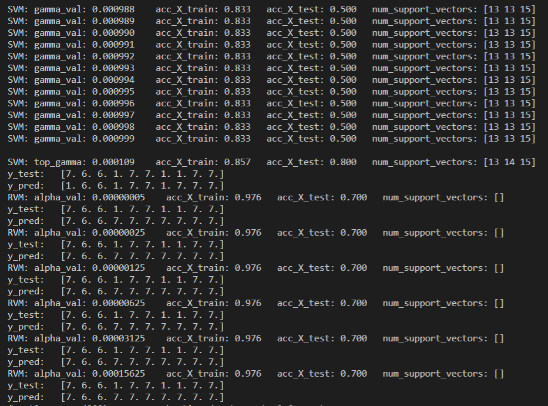

# Small study of SVM vs RVM in ML for micro-controllers
Code that will generate two models SVM and RVM, optimizing the gamma hyper-parameter.

## Description
This is a small study. I was curious to know if the optimization of gamma hyper-parameter of the RVM, could make the model from RVM give better results. In particular with this dataset that Simone use to produce the "Audio Word Detection in Arduino" in the table on the following blog post. [Even smaller Machine learning models for your MCU: up to -82% code size](https://eloquentarduino.github.io/2020/02/even-smaller-machine-learning-models-for-your-mcu/)  
In this table you can see that RVM compares very well with SVM in terms of accuracy but it is as a smaller memory footprint and a faster inference. This is particularly useful in Machine Learning for micro-controllers. 
Simone has made a really remarkable work in showing with projects, while documenting on blog posts, that in fact one can do inference of non trivial models of Machine Learning in small micro-controllers. Please see the [Eloquent Arduino](https://eloquentarduino.github.io/) blog.   
The dataset was made available by Simone [eloquentarduino voice_fft_dataset.py](https://gist.github.com/eloquentarduino/225039696c59475deef7ea182a7e1569) .  
In the references I collected links to interesting theoretical and practical information about RVM's.

## Points to note
Because the data is small 52 cases and high dimensional (32 features) the optimization of gamma in SVM is heavily dependent on the shuffle lottery. If you omit the random_state = 0 in the shuffle call you can see for yourself that you can generate results for the best model, from 60% to 90% accuracy in the test dataset. But you should try to find one that has a similar value between the accuracy of the train and test dataset's, small delta (no overfitting), you should maximize the absolute train accuracy and you should look to see if the 3 classes are represented in the test dataset.      

## Screen shoot
SVM vs RVM output  

## Status of this small study
**Phase 1**  
Currently this work is halted, it's half done because because I couldn't install the project [sklearn_bayes](https://github.com/AmazaspShumik/sklearn_bayes/) it encountered compilation errors, in Windows 10 or in Ubuntu 19.10 Linux both running Python Anaconda. 
The sklearn_bayes package has the fast implementation for RVM that is used in Eloquent Arduino microMLgen at the time that I am writing this words. When I looked in the sklearn_bayes project issues there are others with the some problem. So maybe is a question of time until the problem is resolved and I can resume with this small study.  
 
**Phase 2**  
In phase 1 I reached a death point because I couldn’t install the software, so in phase two I tried to install the other SciKit-learn compatible RVM implementation that used the slower version of the RVM training algorithm (2001 paper).  [JamesRitchie - scikit-rvm](https://github.com/JamesRitchie/scikit-rvm)  This one is based exclusively on Python and NumPy so there were no issues with the installation. I figured that my dataset is really small and because the majority of small micro-controllers dataset’s are small it wouldn’t be a real problem. After testing with my dataset I could easily train 30, 50 or even 100 models in a few minutes.  
 
That said the output image can be seen above and my results are that for this small dataset of 52 entries and 32 dimensions one can see that the SVM can do a good job, because it can archive an 85 % of accuracy on the train set and on the test set a 80% accuracy. Don’t forget that this is a 52 total case dataset , 42 train and 10 test randomly shuffled. But the test set is representative because there are more than one element of every class, and in the total input dataset there were 16 from class 1, 16 from class 6 and 20 from class 7.  
 
But what we see in the RVM is the following; it takes more time to generate a model maybe 100x to 1000x. We see that the Alpha parameter can have a small difference in the outcome for this dataset, from 60% to 70%, but this corresponds to only one case, so it’s not really representative, because the dataset is so small and as 32 dimensions. But even for the 70% of accuracy, we can see a big problem.  All the models generated by RVM completely ignore the class 1 of the test set, they correctly classify the class 6, they correctly classify the class 7 but they fail in all elements of class 1. But they achieve a 97% accuracy on the train dataset that as class 1, so you could say that they have over fitted the class 1. This can be happening because under the wood you can see that you when you generate the model you generate 3 models one for each class versus the rest of the classes. You can see that in the code or while debugging.  I repeated the model generation with several shuffle random_state = 0, 1, 2, 3, 4,5 ,6 and in all there was a big difficulty in  having the correct identification, a difficult on having a high accuracy for the several different test datasets tested.  I also tried to lower the number of iterations in the KM training algorithm trying to find a value that the 1 class classifier would not over fit, but I couldn’t found one.   
 
So my conclusion for this dataset is that RVM is not very good contender, maybe if  RVM had a parameter in which I could adjust the number of relevant support vector and find a tradeoff between memory size and accuracy, but it seems that it doesn’t have one. But for several other dataset’s I think that RVM it is a very good candidate. Based on the data given by Simone from Eloquent Arduino, and from the literature including Bishop Book on section 7.2.3 .  
 
Next path to follow is to study more how the algorithm works to find a way to tune in the individual classifiers in a multi class classifier.

## Dependencies
[Project sklearn_bayes for the fast implementation of RVM](https://github.com/AmazaspShumik/sklearn_bayes/)  
[sklearn_bayes](https://github.com/AmazaspShumik/sklearn_bayes/)  
[Project micromlgen from Eloquent Arduino](https://github.com/eloquentarduino/micromlgen)  

# Glossary
* SVM - Support Vector Machine 
* RVM - Relevant Vector Machine

## References
* [Eloquent Arduino](https://eloquentarduino.github.io/)
* [Project from were I learned about RVM - Relevant Support Machine - Even smaller Machine learning models for your MCU: up to -82% code size](https://eloquentarduino.github.io/2020/02/even-smaller-machine-learning-models-for-your-mcu/)
* [DataSet is from Simone from project Word classification using Arduino and MicroML](https://eloquentarduino.github.io/2019/12/word-classification-using-arduino/)
* [The dataset is from the FFT 32 Arduino audio word classification](https://gist.github.com/eloquentarduino/225039696c59475deef7ea182a7e1569)
* [Project sklearn_bayes for the fast implementation of RVM](https://github.com/AmazaspShumik/sklearn_bayes/)
* [Wikipedia - Relevance vector machine](https://en.wikipedia.org/wiki/Relevance_vector_machine)
* [Tipping's webpage on Sparse Bayesian Models and the RVM](http://www.miketipping.com/sparsebayes.htm)
* [Paper Sparse Bayesian Learning and the Relevance Vector Machine by Michael E. Tipping 2001](http://jmlr.csail.mit.edu/papers/v1/tipping01a.html)
* [Paper Sequential Sparse Bayesian Learning) was discovered later by Faul and Tipping 2003. This documents the fast training algorithm for RVM](http://www.miketipping.com/papers/met-fastsbl.pdf)
* [JamesRitchie - scikit-rvm - Other implementation of RVM with scikit-learn interface but with slower algorithms](https://github.com/JamesRitchie/scikit-rvm)
* [RVM are explained in Section 7.2 of Christopher Bishops's Pattern Recognition and Machine Learning](https://www.microsoft.com/en-us/research/people/cmbishop/?from=http%3A%2F%2Fresearch.microsoft.com%2Fen-us%2Fum%2Fpeople%2Fcmbishop%2Fprml%2F)  

## License
My code is MIT Open Source license, the dataset was made available by Simone from Eloquent Arduino, see references. 
This work is just a small study that I wish to continue because I see real potential in RVM - Relevant Support Machines in the context of small micro-controllers.

## Have fun!
Best regards,  
Joao Nuno Carvalho  
